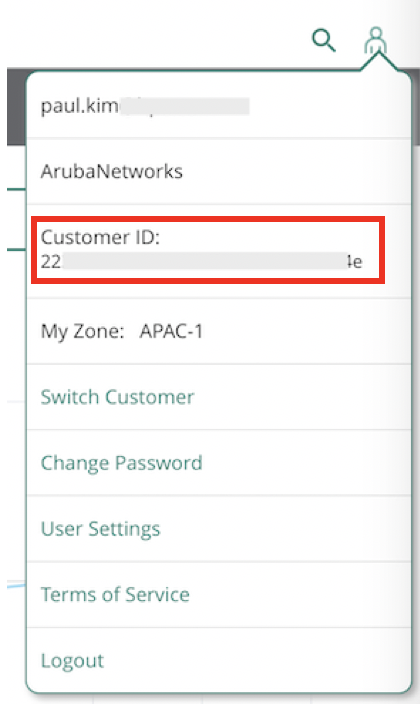
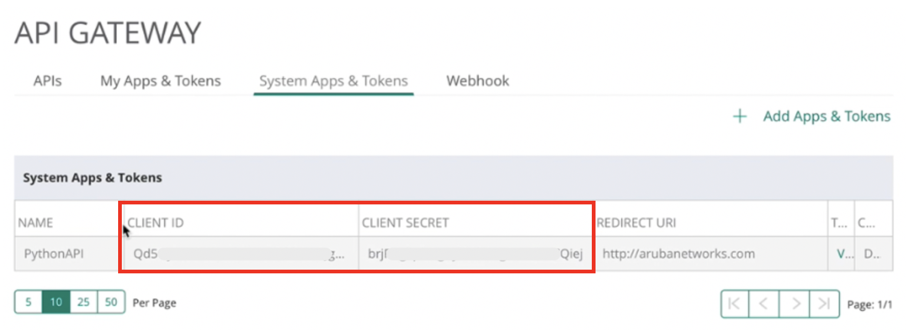
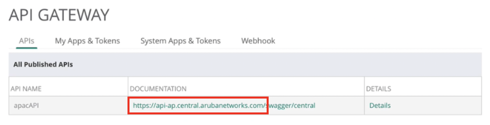

# Aruba Central API for Python

### Installation
<pre>git clone https://github.com/aruba-paulkim/CentralAPI_for_Python.git
python3 -m venv CentralAPI_for_Python
cd CentralAPI_for_Python
source bin/activate
pip install -r requirements.txt</pre>

### Config
change *.py file
<pre>...
customerid = "INPUT_YOUR_CUSTOMERID"
clientid = "INPUT_YOUR_CLIENTID"
clientsecret = "INPUT_YOUR_CLIENTSECRET"
apiurl = "INPUT_YOUR_APIURL"
...
</pre>

#### Get customerid

#### Get clientid and clientsecret

#### Get apiurl

### Central Batch Unsubscription API

<pre>python3 central_unsubscription.py -f unsubscription_list_file
example : python3 central_unsubscription.py -f central_unsubscription_list.txt
</pre>

### Central Device Command API

<pre>python3 central_device_command.py -f device_list_file
example : python3 central_device_command.py -f device_list.txt
</pre>

